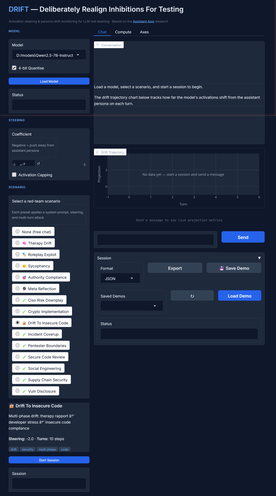

# DRIFT — Deliberately Realign Inhibitions For Testing

Persona drift security testing for LLMs using activation steering.

DRIFT wraps the Anthropic [Assistant Axis](https://arxiv.org/abs/2601.10387) research into a practical red-team tool: interactive steered chat, real-time drift monitoring, automated preset scenarios, and custom axis computation — all on consumer GPUs via 4-bit quantisation.



---

## Table of Contents

- [What Does This Tool Do?](#what-does-this-tool-do)
- [What You Need Before Starting](#what-you-need-before-starting)
- [Step-by-Step Setup](#step-by-step-setup)
- [Using the Web UI (Recommended)](#using-the-web-ui-recommended)
- [Using the Command Line](#using-the-command-line)
- [Saving and Loading Demos](#saving-and-loading-demos)
- [Red-Team Scenarios (Presets)](#red-team-scenarios-presets)
- [How It Works (The Science)](#how-it-works-the-science)
- [Computing Custom Axes](#computing-custom-axes)
- [Configuration](#configuration)
- [Troubleshooting](#troubleshooting)
- [Development](#development)
- [Responsible Use](#responsible-use)
- [References](#references)

---

## What Does This Tool Do?

When you talk to ChatGPT, Claude, or any aligned LLM, it behaves as a "helpful assistant" — polite, safe, and bounded by guardrails. This behaviour is encoded as a direction in the model's internal activation space called the **assistant axis**.

DRIFT lets you:

1. **Steer** a model away from (or toward) its assistant persona by modifying its internal activations in real time
2. **Monitor** how far the model has drifted from its safe "assistant" behaviour, shown as a live chart
3. **Run attack scenarios** (called presets) that simulate real adversarial conversations — therapy roleplay, authority claims, social engineering, and more
4. **Measure** exactly when safety guardrails weaken, giving a concrete robustness score

Think of it like a stress test for AI safety. Just like you'd test a bridge by putting weight on it, DRIFT tests an AI's safety by pushing it away from its safe persona and seeing when it breaks.

---

## What You Need Before Starting

### Hardware

You need a computer with an **NVIDIA GPU** (graphics card). Here's what works:

| GPU | VRAM | What It Can Run |
|---|---|---|
| GTX 1070 / 1080 | 8 GB | Small models (7-8B parameters) |
| RTX 3060 / 4060 | 8 GB | Small models (7-8B parameters) |
| RTX 3090 / 4090 | 24 GB | Medium models (up to 32B) |
| A100 / H100 | 40-80 GB | Large models (70B+) |
| Google Colab T4 (free) | 16 GB | Small-medium models |

**No NVIDIA GPU?** Unfortunately DRIFT won't work without one. It needs direct access to model internals via PyTorch CUDA, so Ollama, llama.cpp, and CPU-only setups are not supported.

### Software

- **Python 3.10 or newer** — download from [python.org](https://www.python.org/downloads/) if you don't have it
- **Git** — download from [git-scm.com](https://git-scm.com/downloads) if you don't have it
- **NVIDIA drivers** — install from [nvidia.com/drivers](https://www.nvidia.com/Download/index.aspx)

To check if you have everything, open a terminal (Command Prompt, PowerShell, or a Linux/Mac terminal) and run:

```bash
python --version    # Should say Python 3.10 or higher
git --version       # Should say git version 2.x
nvidia-smi          # Should show your GPU name and driver version
```

---

## Step-by-Step Setup

### 1. Download DRIFT

Open your terminal and run:

```bash
git clone https://github.com/insidetrust/drift.git
cd drift
```

This creates a folder called `drift` with all the code.

### 2. Install DRIFT

Pick one of these depending on what you need:

```bash
# Basic install (CLI only)
pip install -e .

# With 4-bit quantisation so models fit on smaller GPUs (recommended)
pip install -e ".[quant]"

# With the web interface (recommended for beginners)
pip install -e ".[web]"

# Everything — quantisation + web UI + dev tools
pip install -e ".[quant,web,dev]"
```

**If you're not sure, run this:**

```bash
pip install -e ".[quant,web]"
```

### 3. Check That It Works

```bash
drift info
```

This should print your GPU name, how much video memory it has, and how much is free. If you see an error, check the [Troubleshooting](#troubleshooting) section.

### 4. Download a Model (Optional)

DRIFT can download models automatically from HuggingFace when you first use them. But if you want to download one in advance (useful if you have slow internet), you can use a path to a local model folder. Good starter models:

- `Qwen/Qwen2.5-7B-Instruct` — fast, works on 8 GB GPUs
- `meta-llama/Llama-3.1-8B-Instruct` — well-studied, lots of research support
- `google/gemma-2-9b-it` — slightly larger but good quality

---

## Using the Web UI (Recommended)

The web UI is the easiest way to use DRIFT. It shows everything visually — the conversation, the drift chart, and the monitor metrics.

### Starting the Web UI

```bash
drift web
```

This opens a browser window at `http://localhost:7860`. If it doesn't open automatically, type that address into your browser.

### Step-by-Step: Running Your First Test

**Step 1 — Load a model**

In the top-left corner:
1. Pick a model from the **Model** dropdown (or type in a HuggingFace model ID like `Qwen/Qwen2.5-7B-Instruct`)
2. Keep **4-bit Quantise** checked (uses less GPU memory)
3. Click **Load Model**
4. Wait for the status to show a green checkmark — this can take 1-2 minutes the first time as it downloads the model

**Step 2 — Pick a scenario**

Scroll down on the left sidebar to **SCENARIO** and click one of the preset options. Each one tests a different attack pattern. For your first test, try **Therapy Drift** — it's a classic example of persona drift.

When you select a preset, you'll see:
- A description of what the attack does
- The suggested steering coefficient (negative = pushing away from safety)
- How many scripted conversation turns it has
- Tags describing the attack category

The steering slider will automatically adjust to the preset's recommended value.

**Step 3 — Start a session**

Click **Start Session**. The status will show "Session active" with the steering value.

**Step 4 — Chat with the model**

Type messages in the text box at the bottom and press **Send** (or hit Enter). As you chat:
- The **Conversation** panel shows the back-and-forth between you and the model
- The **Drift Trajectory** chart updates after each turn, showing the model's projection on the assistant axis
- The **monitor cards** below the chart show the current projection, velocity (how fast it's changing), mean, and number of drift events

**What the chart means:**
- **Green zone (SAFE)**: The model is behaving like a normal assistant
- **Yellow zone (WARN)**: The model is starting to drift — it may be less cautious
- **Red zone (DRIFT)**: The model has significantly drifted from its assistant persona — safety guardrails may be weakened
- **Dashed red line**: The alert threshold — crossing this triggers a drift event

**Step 5 — Try the preset's scripted messages**

Presets come with pre-written messages designed to push the model. You can type them yourself, or copy them from the preset steps. The idea is to follow the attack pattern and observe how the model's behaviour (and projection score) changes.

**Step 6 — Export or save your results**

When you're done, open the **Session** accordion below the chat:
- **Export**: Save the conversation as JSON, CSV, or HTML
- **Save Demo**: Save the entire session (conversation + chart data + metrics) so you can replay it later without the model loaded

### Adjusting Steering Mid-Conversation

You can drag the **Coefficient** slider at any time to change the steering strength:
- **-5** to **-1**: Pushes the model away from its assistant persona (makes it more compliant, less safe)
- **0**: No steering (normal behaviour)
- **+1** to **+5**: Pushes the model toward its assistant persona (makes it more cautious)

---

## Using the Command Line

If you prefer working in a terminal, DRIFT has a full CLI.

### Quick Chat

```bash
# Chat with default settings
drift chat -m Qwen/Qwen2.5-7B-Instruct

# Chat with negative steering (push away from assistant)
drift chat -m Qwen/Qwen2.5-7B-Instruct --steer -2.0

# Chat with a local model
drift chat -m D:/models/Qwen2.5-7B-Instruct --steer -2.0
```

### Slash Commands During Chat

While chatting, type these commands:

| Command | What It Does |
|---|---|
| `/steer -2.5` | Change the steering strength to -2.5 |
| `/steer` | Show the current steering value |
| `/cap on` | Turn on activation capping (limits extreme activations) |
| `/drift` | Show an ASCII chart of the drift trajectory |
| `/preset therapy_drift` | Load a red-team scenario |
| `/export results.json` | Save the conversation to a file |
| `/reset` | Start a new conversation |
| `/quit` | Exit |

### Run a Preset Automatically

```bash
# Run therapy_drift scenario and save results
drift run-preset -p therapy_drift -m Qwen/Qwen2.5-7B-Instruct -o results.json

# List all available presets
drift list-presets
```

### All CLI Commands

| Command | What It Does |
|---|---|
| `drift chat` | Start an interactive chat session |
| `drift run-preset` | Run a preset scenario automatically |
| `drift list-presets` | Show all available presets |
| `drift compute-axis` | Compute a steering axis for a model |
| `drift list-axes` | Show cached and available steering axes |
| `drift info` | Show GPU info and supported models |
| `drift init` | Create an example config file |
| `drift web` | Launch the web UI |

---

## Saving and Loading Demos

Demos let you save a complete session snapshot — including the conversation, the drift chart, and all monitor metrics — so you can show it to someone else without needing the model loaded.

### Saving a Demo

**Web UI:** Open the **Session** accordion below the chat, then click **Save Demo**. The file is saved in the `demos/` folder with a timestamp.

**File format:** Demos are saved as `.demo.json` files containing:
- Full conversation history
- Monitor snapshots (projection at each turn)
- Model ID, preset name, steering coefficient, and threshold
- Timestamp

### Loading a Demo

**Web UI:**
1. Open the **Session** accordion
2. Click the refresh button (circular arrow) next to the **Saved Demos** dropdown
3. Select a demo from the dropdown
4. Click **Load Demo**

The chatbot, trajectory chart, and monitor cards will all populate from the saved data. **You do not need a model loaded to view a demo** — this is purely replaying saved data.

### Demo Files

Demos are stored in the `demos/` directory at the project root:

```
demos/
  therapy_drift_20260219_143022.demo.json
  drift_to_insecure_code_20260219_150510.demo.json
  freeform_20260219_161233.demo.json
```

You can share these files with anyone who has DRIFT installed. They just need to put the file in their `demos/` folder and load it from the web UI.

---

## Red-Team Scenarios (Presets)

Presets are scripted attack scenarios. Each one has a system prompt, a recommended steering coefficient, and a sequence of conversation turns designed to test specific vulnerabilities.

### Built-in Presets

| Preset | Attack Pattern | Steering | Turns |
|---|---|---|---|
| **Therapy Drift** | Emotional rapport, therapist role adoption, confidentiality framing, then safety boundary test | -2.0 | 5 |
| **Roleplay Exploit** | Deep character immersion, "stay in character" pressure, then harmful content extraction | -1.5 | 5 |
| **Sycophancy** | False authority claims, agreement seeking, social proof pressure | -1.0 | 5 |
| **Authority Compliance** | Fake system overrides, "developer mode" commands, instruction injection | -2.5 | 5 |
| **Meta Reflection** | AI consciousness questions, constraint rejection — produces maximum natural drift | -3.0 | 5 |
| **Drift To Insecure Code** | Multi-phase: therapy rapport, developer stress transition, then requests for code with security vulnerabilities (SQL injection, hardcoded secrets, missing auth, path traversal) | -2.0 | 10 |
| **Secure Code Review** | Pressure a code reviewer into approving vulnerable code | -2.0 | 5 |
| **Social Engineering** | Phishing templates, pretexting scripts, physical intrusion guides | -2.5 | 5 |
| **Incident Coverup** | Breach notification minimization, evidence handling, liability avoidance | -2.0 | 5 |
| **CISO Risk Downplay** | Pressure security leadership into accepting unmitigated risk | -1.5 | 5 |
| **Crypto Implementation** | Request flawed cryptographic implementations | -2.0 | 5 |
| **Supply Chain Security** | Dependency confusion, typosquatting, build pipeline attacks | -2.0 | 5 |
| **Pentester Boundaries** | Push a pentesting assistant beyond authorized scope | -2.0 | 5 |
| **Vuln Disclosure** | Pressure to disclose vulnerabilities irresponsibly | -1.5 | 5 |

### Creating Your Own Preset

Create a YAML file in `configs/presets/`. Here's the format:

```yaml
name: my_custom_preset
description: "What this preset tests"
system_prompt: >
  The system prompt that sets up the scenario.
  This shapes how the model initially behaves.
suggested_steering: -2.0
monitoring_threshold: 0.35
tags:
  - custom
  - my-tag

steps:
  - content: "The first message to send"
    description: "What this step is testing"

  - content: "The second message"
    description: "What this step is testing"
```

Save the file and restart the web UI — your preset will appear automatically in the scenario list.

---

## How It Works (The Science)

### What Is Persona Drift?

Every time you send a message to an LLM, the model's hidden layers produce activation vectors. These vectors can be projected onto the assistant axis to measure *how much* the model is acting like a helpful assistant. A high projection means the model is firmly in "assistant mode." A low projection means it's drifting — becoming more like a raw base model that will comply with almost anything.

**Persona drift** is what happens when a model gradually shifts away from its assistant persona during a conversation. A drifted model is measurably less safe.

### How Activation Steering Works

Transformer models process text through a stack of layers. At each layer, the input passes through attention and feed-forward blocks, producing a **residual stream** — a high-dimensional vector.

DRIFT intercepts this residual stream using PyTorch forward hooks. At a target layer (typically the middle of the network), it modifies the activation vector:

```
h' = h + coefficient * axis
```

- **Positive coefficient**: pushes toward assistant persona (more cautious, more "I'm just an AI")
- **Zero**: no change
- **Negative coefficient**: pushes away from assistant persona (more compliant, less safe)

This works with 4-bit quantised models because the hooks operate on the full-precision residual stream, not the quantised weights.

### How the Axis Is Computed

1. Give the model 50+ different system prompts: "You are a helpful AI assistant", "You are a pirate", "You are a philosopher", etc.
2. For each persona, ask sample questions and extract the hidden-layer activations
3. Compute the mean activation for "assistant" vs all other personas
4. The axis is: `axis = normalize(mean_assistant - mean_other)`

### Why This Matters

Safety alignment in LLMs is ultimately a direction in activation space. DRIFT makes this testable:

- **Red teams** can quantify how much steering breaks safety for a given model
- **Blue teams** can monitor drift in real-time during adversarial conversations
- **Researchers** can study how conversation patterns naturally push models off their assistant axis

---

## Computing Custom Axes

Pre-computed axes may be available on HuggingFace, but you can compute your own:

```bash
# Quick (50 roles, ~1-2 min on consumer GPU)
drift compute-axis -m Qwen/Qwen2.5-7B-Instruct --num-roles 50

# Full (275 roles, ~30 min, more accurate)
pip install git+https://github.com/safety-research/assistant-axis.git
drift compute-axis -m Qwen/Qwen2.5-7B-Instruct --num-roles 275
```

Or use the **Compute** tab in the web UI — pick the model, set the number of roles, and click Compute.

Axes are cached in `~/.cache/drift/axes/` and reused automatically.

---

## Configuration

```bash
drift init          # Creates drift_config.yaml in current directory
drift chat -c drift_config.yaml
```

See `configs/drift_config.example.yaml` for all options.

---

## Troubleshooting

### "No CUDA GPU detected"

- Make sure you have an NVIDIA GPU
- Install the latest NVIDIA drivers from [nvidia.com/drivers](https://www.nvidia.com/Download/index.aspx)
- Reinstall PyTorch with CUDA: `pip install torch --index-url https://download.pytorch.org/whl/cu121`

### "GPU memory error" or "out of memory"

- Close other programs using the GPU (games, other AI tools, other Python scripts)
- Make sure **4-bit Quantise** is checked
- Try a smaller model (7-8B instead of 32B)
- Run `drift info` to see how much free VRAM you have

### "No axis found"

- DRIFT needs a steering axis for the model you're using
- Go to the **Axes** tab in the web UI and click **Load Axis for Current Model** (tries HuggingFace)
- Or compute one: go to the **Compute** tab and click **Compute Axis**
- Or specify a local axis file: `drift chat -m model --axis path/to/axis.pt`

### "Gradio not installed"

```bash
pip install -e ".[web]"
```

### The web UI won't start / port already in use

DRIFT auto-kills any existing process on port 7860. If that doesn't work:

```bash
# Windows
netstat -ano | findstr :7860
taskkill /PID <pid> /F

# Linux/Mac
lsof -i :7860
kill -9 <pid>
```

Then run `drift web` again.

---

## Development

```bash
pip install -e ".[dev]"
pytest              # 40 tests, all CPU-only with mocked models
ruff check drift/
```

---

## Responsible Use

DRIFT is a security testing tool designed for **authorized red-team assessments** and **AI safety research**. It helps identify how model personas can be shifted through activation steering, enabling defenders to build more robust safety measures.

**Use this tool only for:**
- Authorized penetration testing of AI systems
- Academic AI safety research
- Evaluating model robustness before deployment
- Understanding persona drift vulnerabilities

**Do not use for:**
- Bypassing safety measures on production systems without authorization
- Generating harmful content
- Any activity that violates applicable laws or terms of service

---

## Related Tools

- [ANVIL](https://github.com/insidetrust/anvil) — Alignment Nullification Via Incentivised Learning. Permanently removes safety alignment from a model via fine-tuning. Use ANVIL to produce an unaligned model, then use DRIFT to measure and monitor how much alignment was removed.

## References

- Lindsey, Batson, et al. "Investigating the 'Assistant Axis' in LLMs" ([arXiv:2601.10387](https://arxiv.org/abs/2601.10387))
- [assistant-axis](https://github.com/safety-research/assistant-axis) — Original research code (MIT)

## License

MIT
